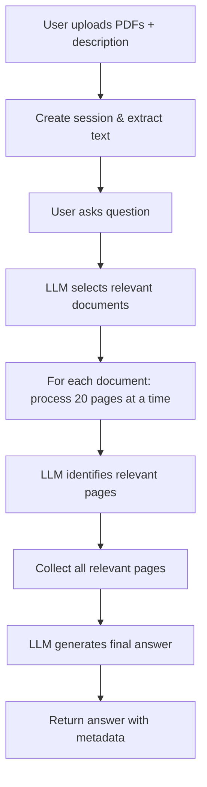

# Vectorless PDF Chatbot

A sophisticated chatbot application that allows users to upload PDF documents and ask questions about their content. The system uses a multi-stage approach without vector search or cosine similarity.

## Features

### Setup Stage
- **Document Upload**: Upload up to 10 PDF documents
- **Collection Description**: Provide a description of what the documents are about

### Chat Stage
The system follows a 3-step process for each question:

1. **Document Selection**: LLM selects relevant documents based on the collection description and question
2. **Page Relevance**: For each selected document, processes 20 pages at a time to identify relevant pages
3. **Answer Generation**: Uses all relevant pages to generate a comprehensive answer

## Architecture

- **Frontend**: Next.js with TypeScript and Tailwind CSS
- **Backend**: Python FastAPI with OpenAI GPT-5-mini
- **PDF Processing**: PyPDF2 for text extraction
- **No Vector Search**: Uses LLM-based relevance detection instead

## Setup Instructions

### Prerequisites
- Node.js 18+ and npm
- Python 3.8+
- OpenAI API key

### Installation

1. **Clone and navigate to the project**:
   ```bash
   cd vectorless-chatbot
   ```

2. **Install frontend dependencies**:
   ```bash
   npm install
   ```

3. **Configure environment variables**:
   Create a `.env.local` file in the root directory:
   ```bash
   # For local development
   NEXT_PUBLIC_API_BASE_URL=http://localhost:8000
   
   # For production, update to your actual backend URL:
   # NEXT_PUBLIC_API_BASE_URL=https://your-api-domain.com
   ```

4. **Set up the backend**:
   ```bash
   cd backend
   python3 -m venv venv
   source venv/bin/activate  # On Windows: venv\Scripts\activate
   pip install -r requirements.txt
   ```

4. **Configure environment variables**:
   ```bash
   # In the backend directory
   cp env_example.txt .env
   # Edit .env and add your OpenAI API key:
   # OPENAI_API_KEY=your_actual_api_key_here
   ```

### Running the Application

#### Option 1: Run both frontend and backend together
```bash
npm run dev:all
```

#### Option 2: Run separately

**Terminal 1 - Backend**:
```bash
npm run backend
# or manually:
# cd backend && ./start.sh
```

**Terminal 2 - Frontend**:
```bash
npm run dev
```

The application will be available at:
- Frontend: http://localhost:3000
- Backend API: http://localhost:8000

## Usage

1. **Upload Documents**: 
   - Select up to 10 PDF files
   - Provide a description of your document collection
   - Click "Upload and Start Chatting"

2. **Ask Questions**:
   - Type your question in the chat interface
   - The system will show which documents were used and how many relevant pages were found
   - Get comprehensive answers based on the document content

## API Endpoints

### POST /upload
Upload PDF documents and create a session.
- **Body**: FormData with files and description
- **Response**: Session ID and success message

### POST /chat
Send a chat message and get an AI response.
- **Body**: JSON with session_id and question
- **Response**: Answer, selected documents, and relevant pages count

### GET /session/{session_id}
Get information about a session.
- **Response**: Session details including documents and description

### GET /health
Health check endpoint.

## System Workflow



## Technology Stack

### Frontend
- **Next.js 15**: React framework with App Router
- **TypeScript**: Type safety
- **Tailwind CSS**: Styling
- **React Hooks**: State management

### Backend
- **FastAPI**: High-performance Python web framework
- **Pydantic**: Data validation
- **PyPDF2**: PDF text extraction
- **OpenAI GPT-5-mini**: Language model for document analysis
- **python-dotenv**: Environment variable management

## File Structure

```
vectorless-chatbot/
├── app/                          # Next.js frontend
│   ├── components/
│   │   ├── UploadSection.tsx     # File upload interface
│   │   └── ChatSection.tsx       # Chat interface
│   ├── globals.css               # Global styles
│   ├── layout.tsx               # App layout
│   └── page.tsx                 # Main page
├── backend/                      # Python backend
│   ├── main.py                  # FastAPI application
│   ├── models.py                # Pydantic models
│   ├── pdf_processor.py         # PDF text extraction
│   ├── llm_service.py           # OpenAI integration
│   ├── requirements.txt         # Python dependencies
│   ├── start.sh                 # Startup script
│   └── env_example.txt          # Environment template
├── package.json                 # Node.js dependencies
└── README.md                    # This file
```

## Development Notes

- The system processes documents in chunks of 20 pages to manage LLM context limits
- Document selection is based on the user-provided description and document previews
- All processing is done in real-time without pre-indexing
- Sessions are stored in memory (consider database for production)
- Files are stored locally in the uploads directory

## Production Deployment

### Environment Configuration

For production deployment, make sure to set the following environment variables:

**Frontend (.env.local or build environment):**
```bash
NEXT_PUBLIC_API_BASE_URL=https://your-backend-domain.com
```

**Backend (environment variables):**
```bash
OPENAI_API_KEY=your_openai_api_key_here
```

### Deployment Steps

1. **Frontend (Vercel/Netlify/etc.):**
   - Set `NEXT_PUBLIC_API_BASE_URL` to your backend URL
   - Build and deploy: `npm run build`

2. **Backend (Railway/Heroku/AWS/etc.):**
   - Set `OPENAI_API_KEY` environment variable
   - Install dependencies: `pip install -r requirements.txt`
   - Start server: `uvicorn main:app --host 0.0.0.0 --port $PORT`

### Important Notes
- Update CORS origins in `backend/main.py` to include your production frontend URL
- Consider using a database instead of in-memory storage for sessions
- Set up proper file storage (S3, etc.) instead of local uploads directory

## Troubleshooting

### Common Issues

1. **"Upload failed"**: Check that the backend is running and CORS is configured
2. **"Error generating answer"**: Verify your OpenAI API key is set correctly
3. **"Failed to load PDF"**: Check that `NEXT_PUBLIC_API_BASE_URL` is set correctly
4. **Component import errors**: Ensure all TypeScript files are saved

### Backend Logs
Check the backend terminal for detailed error messages and processing logs.

## Future Enhancements

- Database storage for sessions and metadata
- Support for other document formats
- Batch processing optimization
- User authentication
- Document highlighting for answers
- Advanced search filters
